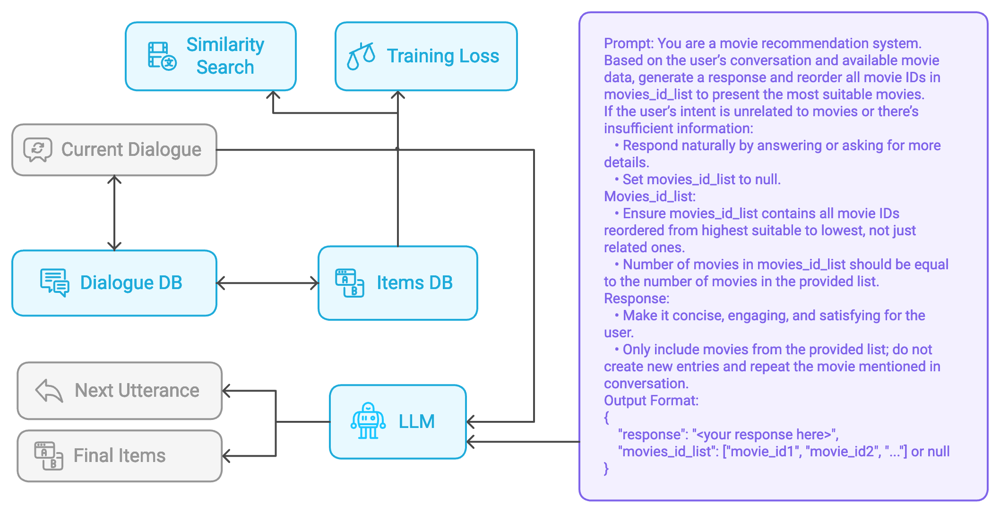
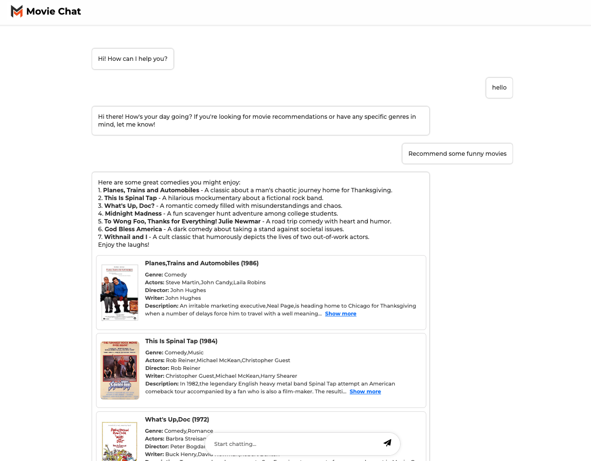

# Robust User-Centric Retrieval-Based Conversational Recommendation Systems

## Overview
Conversational recommendation systems (CRS) aim to engage users by inferring preferences from dialog history, providing accurate suggestions, and generating relevant responses. While retrieval-based CRS offer flexibility and outperform traditional methods, such as those using Knowledge Graphs, they often fail to effectively utilize user history or information from past interactions that contain valuable insights into user preferences. Additionally, these systems are heavily influenced by the quality of metadata associated with retrieved items, and their training and inference processes can be computationally expensive. This paper presents a novel approach that incorporates user history and similar user conversations into the current dialog to enhance recommendation performance while reducing dependency on metadata. We propose the use of a Weighted Supervised Contrastive Loss to improve both accuracy and query response time. Furthermore, we leverage large language models (LLMs) for reranking items and goal-based generation, simplifying and decoupling the recommendation and generation pipelines, and utilizing the inherent knowledge within LLMs without incurring additional training costs.

## System Architecture


## Demo Interface


## Features
- User history integration for enhanced recommendation accuracy
- Weighted Supervised Contrastive Loss implementation
- LLM-based reranking and response generation
- Efficient vector database integration
- Real-time conversation processing
- Scalable architecture design

## Prerequisites
- Python 3.11
- Docker and Docker Compose
- Sufficient storage space for movie thumbnails
- RAM requirements: Minimum 8GB recommended
- CUDA-compatible GPU (optional, for improved performance)

## Installation

### 1. Environment Setup
```bash
# Create and activate virtual environment
python -m venv venv
source venv/bin/activate  # On Windows: .\venv\Scripts\activate

# Install dependencies
pip install --no-cache-dir -r requirements.txt
```

### 2. Database Setup
```bash
# Start Docker containers
docker compose up -d

# Initialize MovieDB and populate Weaviate
python src/database/create_movie_db.py
```

### 3. Asset Installation
1. Download movie thumbnails from [Google Drive](https://drive.google.com/file/d/1Qhu6-tKk-PQLpAM4IQU0V0uuheyaklll/view?usp=drive_link)
2. Extract and place the contents in the `static/assets` directory
3. Verify the assets are correctly placed with the expected directory structure

## Running the Application
```bash
# Start the server
uvicorn app:app --host 0.0.0.0 --port 8099

# Access the application
Open http://localhost:8099 in your web browser
```

## Project Structure
```
.
├── src/
│   ├── database/
│   │   └── create_movie_db.py
│   ├── training/
│   ├── components/
│  
├── static/
│   └── assets/
├── templates/
├── requirements.txt
├── docker-compose.yml
└── app.py
```

## Configuration
Key configuration parameters can be modified in `config.yaml`:
- Vector database settings
- Model parameters
- API endpoints
- Performance tuning options

## Citation
If you use this work in your research, please cite:
```bibtex
@article{nguyen2024robust,
  title={Robust User-Centric Retrieval-Based Conversational Recommendation Systems},
  author={Nguyen Ba, Thiem and Hoang Thanh, Dat and Nguyen Ba, Duong and 
          Phan Dinh, Truong and Doan Minh, Viet},
  institution={Hanoi University of Science and Technology},
  year={2024}
}
```

## Acknowledgments
- Hanoi University of Science and Technology
- All contributors and researchers who provided feedback
- Open-source communities whose tools were used in this project